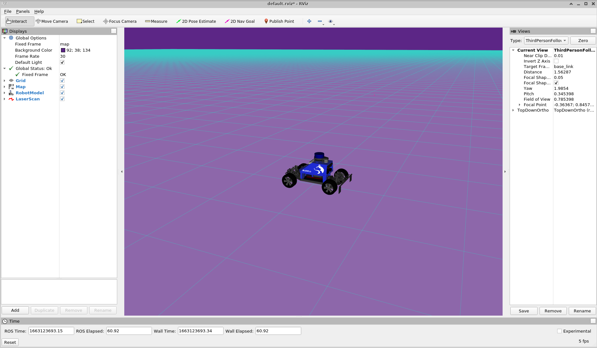
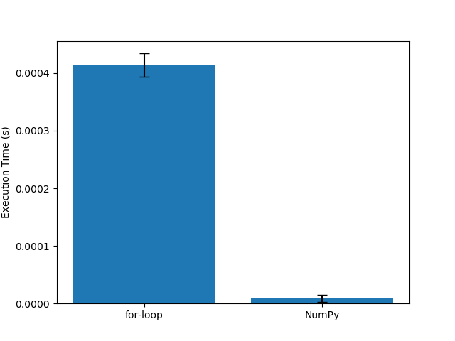
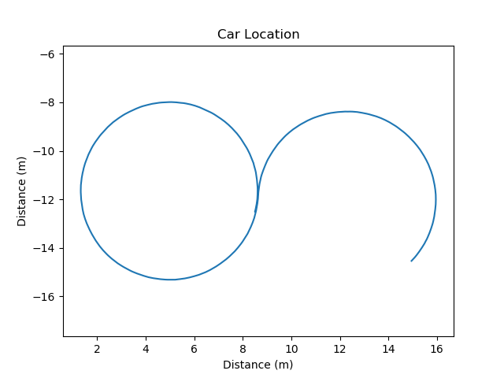
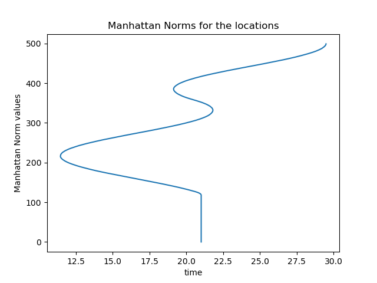
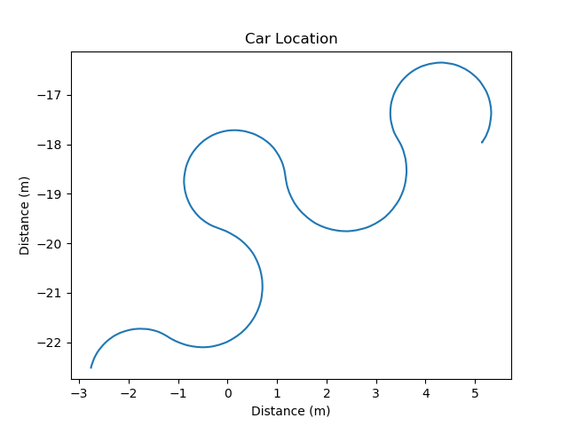
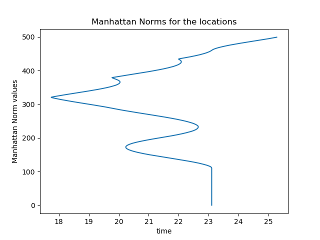
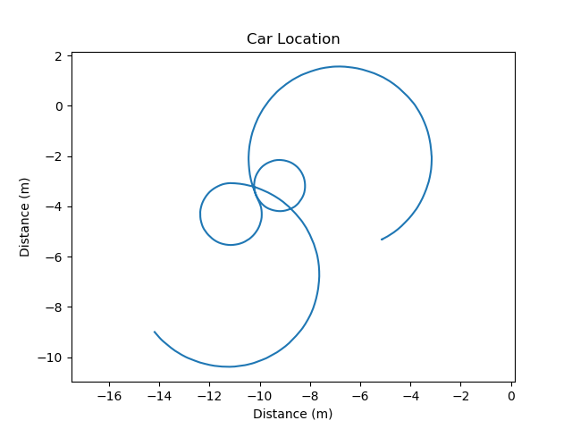
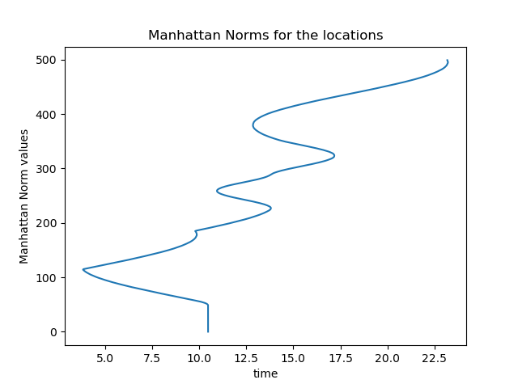

# Project 1: Introduction [![tests]](../../../badges/submit-proj1/pipeline.svg)](../../../pipelines/submit-proj1/latest)
## 1. Define in your own words what a node, topic, publisher, and subscriber are and how they relate to each other.
- node: is a process that performs a specific task, an executable file that runs independently. Different nodes can use different programming languages(e.g. c++, python)
- topic: is a route used to transfer data, which include the message type
- publisher: send the data to the topic
- subscriber: receive the data from the subscribed topic
- How they related?
    - Topic is an asynchronous communication mechanism that is used as a way to transfer data between nodes. Topics transmit data through a publisher and subscriber model. Publishers send data to one or more topics, while subscribers can fetch data from one or more subscribed topics.

## 2. What is the purpose of a launch file?
The purpose of launch file is we can use XML file for the configuration and startup of multiple nodes. It reduces a lot of duplication of work.

## 3. Include the RViz screenshot showing the car.

## 4. Include your runtime_comparison.png figure for the different norm implementations.

### 5. Include the locations.png and norms.png figures for the plan figure_8.txt.

## 6. Include the locations.png and norms.png figures for the plan crown.txt.

## 7. Include your own plan file, any code you wrote to generate it, and the resulting locations.png figure.
The following part is my own plan. I am trying to run like a bow.

