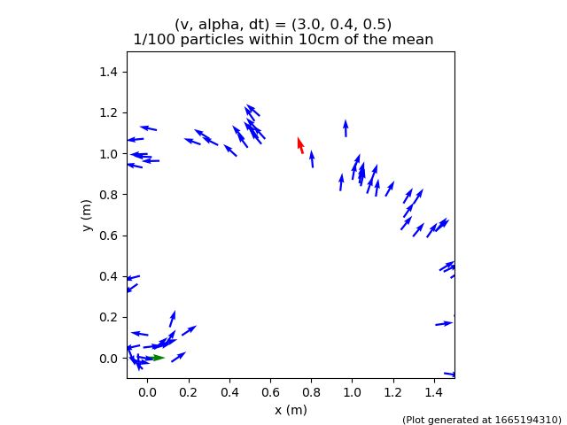
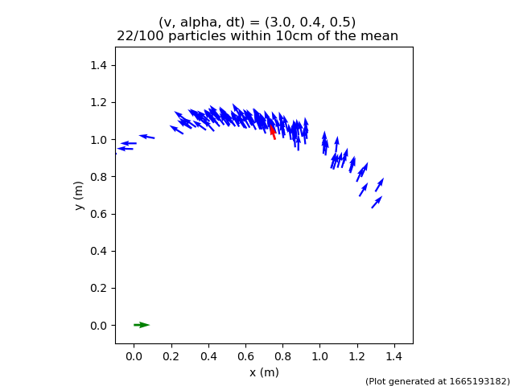
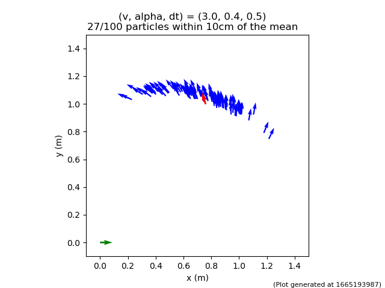

Name: Kane Li

NetID: jl3485

Derivation for state update:

$$
\begin{align*}
&\int_{x_{t-1}}^{x_{t}}dx\ =
\int_{t}^{t+\Delta t} vcos(\theta)dt = 
\int_{t}^{t+\Delta t} vcos(\theta)\frac{d\theta}{\frac{v}{L}tan(\alpha)}
= \frac{L}{tan(\alpha)}\int_{\theta_{t-1}}^{\theta_{t}}cos(\theta)d\theta\\\
\end{align*}
$$

$$
\begin{align*}
&\int_{y_{t-1}}^{y_{t}}dx\ =
\int_{t}^{t+\Delta t} vsin(\theta)dt = 
\int_{t}^{t+\Delta t} vsin(\theta)\frac{d\theta}{\frac{v}{L}tan(\alpha)}
= \frac{L}{tan(\alpha)}\int_{\theta_{t-1}}^{ \theta_{t}}sin(\theta)d\theta\\\
\end{align*}
$$

$$
\begin{align*}
&x_{t} - x_{t-1} = \frac{L}{tan(\alpha)}[sin(\theta_{t})-sin(\theta_{t-1})]\\
&x_{t} = x_{t-1} + \frac{L}{tan(\alpha)}[sin(\theta_{t})-sin(\theta_{t-1})]
\end{align*}
$$

$$
\begin{align*}
&y_{t} - y_{t-1} = \frac{L}{tan(\alpha)}[-cos(\theta_{t})+cos(\theta_{t-1})]\\
&y_{t} = y_{t-1} + \frac{L}{tan(\alpha)}[-cos(\theta_{t})+cos(\theta_{t-1})]
\end{align*}
$$

1.3:

1.5

*M1 motion_params*:
  vel_std:    0.05
  alpha_std:  0.5
  x_std:      0.05
  y_std:      0.05
  theta_std:  0.01

*M2 motion_params*:
  vel_std:    0.04
  alpha_std:  0.1
  x_std:      0.05
  y_std:      0.01
  theta_std:  0.01

*M3 motion_params*:
  vel_std:    0.04
  alpha_std:  0.07
  x_std:      0.01
  y_std:      0.01
  theta_std:  0.01

Result: modified the x_std and alpha_std

