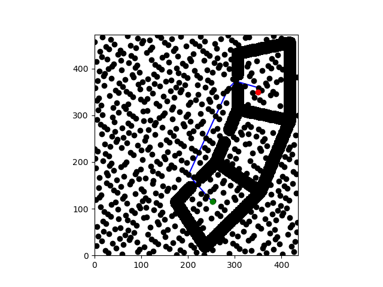
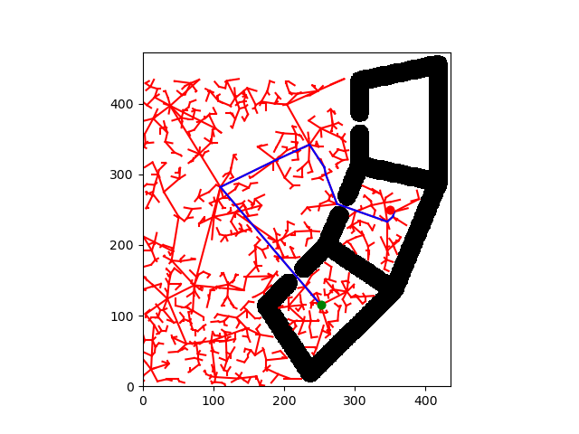

# Project 4: Planning 

## 1.2

## 2.1

## 4
### how did you design your heuristic function?
The code logic of the `heuristic` function is very similar to `cost_to_come` function. So, I use same way to implement Q4.

This question is asking to calculate edge costs between nodes. `cost_to_come` is between `start_config` and `goal_config`, which is start node to goal node. `cost_to_go/heuristic` is to calculate `config` and `goal_config`. 

An `admissible heuristic` is a non-negative function `n` of nodes, where number of nodes is never greater than the actual cost of the shortest path from node n to a goal.

