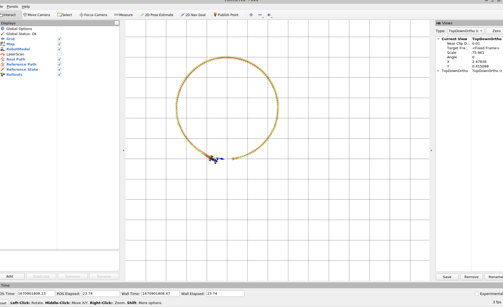
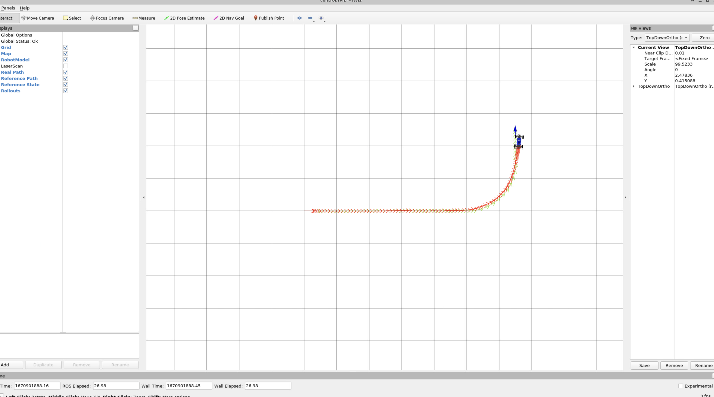
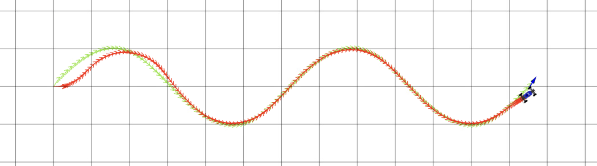

# Project 3: Control 

# Q2
- pid:
  - kp: 0.65
  - kd: 0.38
- mpc:
  - K: 65
  - T: 8
  - distance_lookahead: 1.3

### circle

### left-turn

### wave

Increasing Kp can speed up the system response, but the system becomes less stable. Proportional control is a kind of immediate control, as long as there is deviation, the control quantity is output immediately. Increasing Kd can speed up the system response. [0.5,0.5] does not run badly so I just need to make it run better.

# Q4
First I tried increasing K and T at the same time, and I found that K needs to be around 60 for the system to avoid obstacles properly. In addition I I tried to keep increasing T to get feedback that T has good performance at number 8. About distance_lookahead, only 1.3 could make me pass the test. This is because the distance between some cases of obstacles is very small so we can not set it too high.
